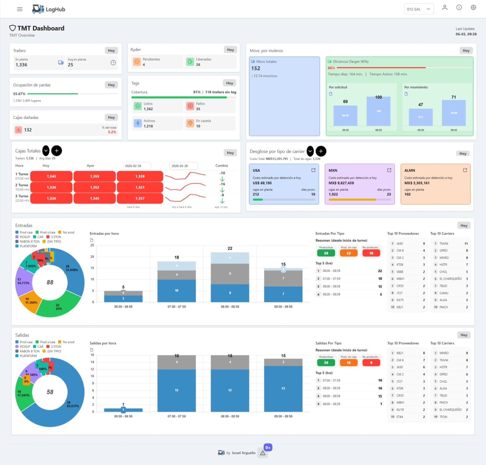
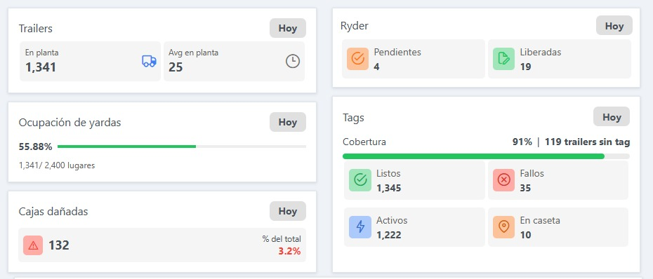
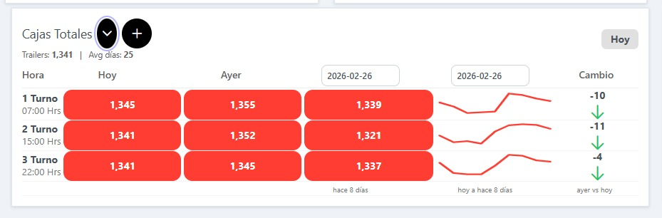
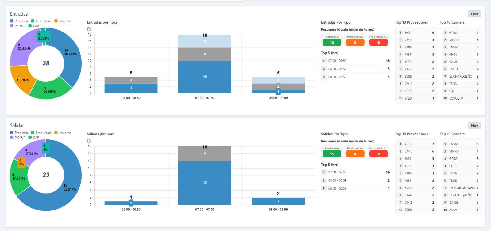
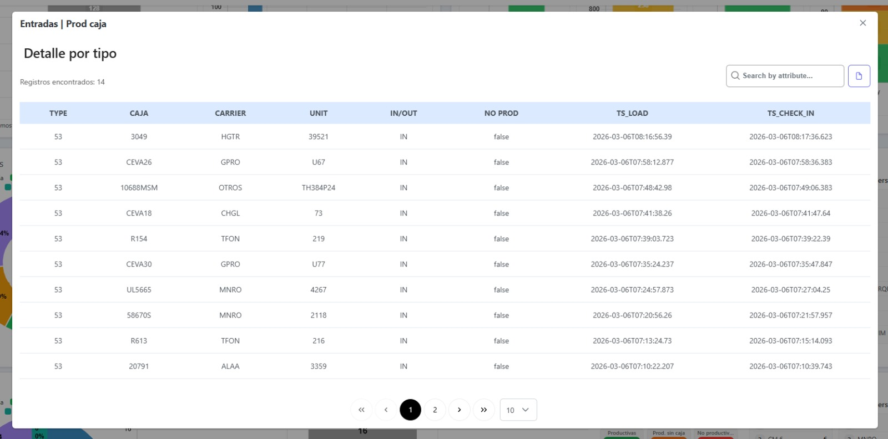
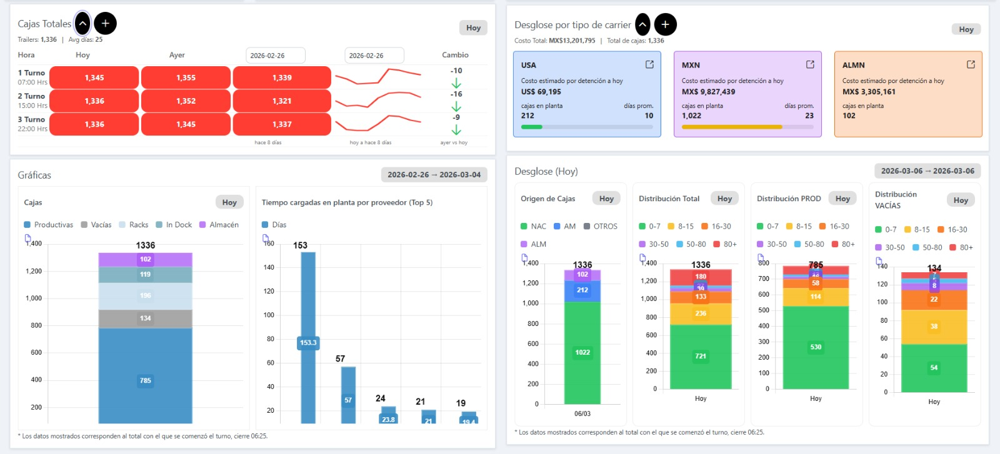
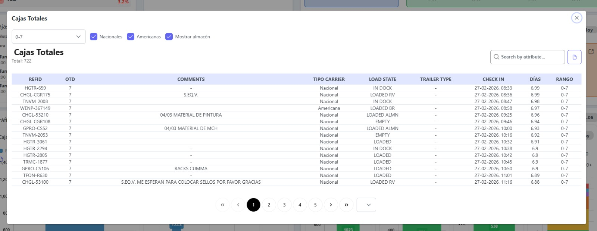
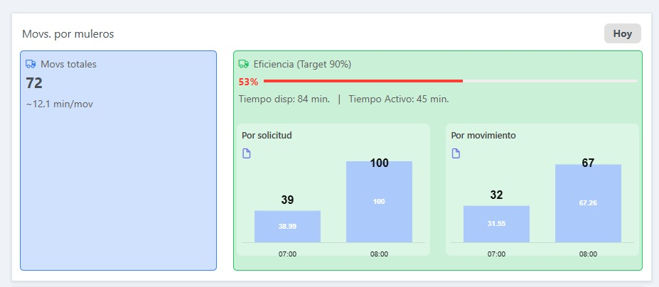
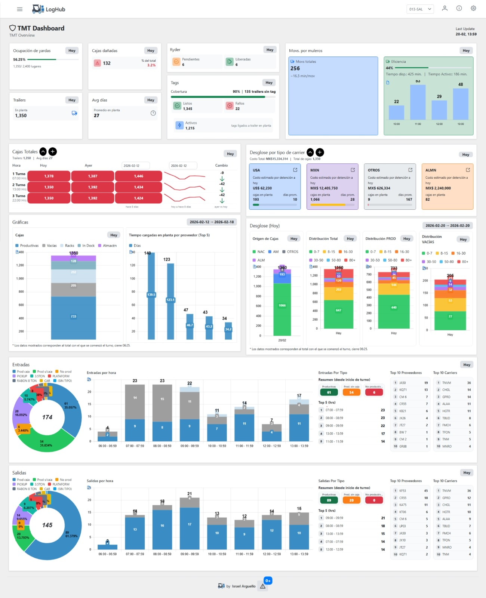

# Industrial Logistics Monitoring Dashboard



## Overview

Industrial Logistics Monitoring Dashboard is a real-time operational dashboard designed to support logistics visibility and KPI tracking in an industrial environment.

The system consolidates multiple operational metrics into a single interface, allowing users to monitor trailer yard activity, box distribution, provider performance, movement efficiency, and other plant-level logistics indicators.

The dashboard was built to provide decision-makers with a centralized operational overview through visual analytics, KPI widgets, and interactive monitoring panels.

The application was developed as a modular web dashboard using **Angular**, **SQL**, and **REST APIs**, combining backend data processing with frontend visualization components.

### Main Capabilities

- Real-time KPI monitoring  
- Trailer and yard occupancy visualization  
- Box distribution and movement analysis  
- Carrier and provider performance tracking  
- Dynamic chart-based operational summaries  
- Modular dashboard sections for different logistics views  

---

<table width="100%">
<tr>

<td width="50%" valign="top">

## Problem

Industrial logistics operations generate large volumes of operational data across trailers, yard movements, providers, carriers, and box distribution.

Without a centralized dashboard, this information is typically fragmented across reports, spreadsheets, or multiple internal views, creating several operational challenges:

- Limited real-time visibility of logistics KPIs  
- Slower decision-making during operational shifts  
- Difficulty identifying bottlenecks and inefficiencies  
- Poor visibility of trailer yard status and movement flows  
- Lack of consolidated insights across carriers, providers, and distribution categories  

As operations grow, the absence of visual monitoring tools makes it harder to react quickly and maintain efficient plant logistics.

</td>

<td width="50%" valign="top">

## Solution

This dashboard was developed to centralize industrial logistics information into a single visual platform.

It integrates operational data from backend services and presents it through KPI cards, charts, comparative summaries, and monitoring widgets that help users understand the current state of yard and box operations.

The dashboard enables users to quickly identify operational conditions such as:

- Yard occupancy  
- Trailer volume in plant  
- Average days in plant  
- Movement activity  
- Distribution by range and category  
- Cost exposure by carrier  
- Entry and exit trends by hour  

The solution was designed with a **modular and scalable dashboard architecture**, allowing individual sections to evolve independently as operational needs grow.

</td>

</tr>
</table>

---

# System Architecture

The dashboard follows a modular web architecture that connects frontend visualization components with backend services and relational data sources.

**Frontend → Angular**  
**Backend Services → REST APIs**  
**Database Layer → SQL**  
**Visualization Layer → KPI Cards, Charts, Monitoring Widgets**

The system retrieves operational data from backend endpoints, processes KPI summaries, and renders them through reusable dashboard components focused on real-time visibility and analytics.

---

# Core Modules

<table width="100%">
<tr>

<td width="50%" valign="top">

## 📊 KPI Monitoring

Provides high-level operational summaries through compact dashboard cards.

**Includes**

- Yard occupancy  
- Damaged boxes  
- Trailer count in plant  
- Average days in plant  
- Ryder tracking  
- Tag coverage and failures  
- Movement efficiency  

</td>

<td width="50%" valign="top">

## 📈 Operational Charts

Displays visual summaries of logistics behavior and historical comparisons.

**Includes**

- Box distribution charts  
- Hourly entries and exits  
- Provider performance charts  
- Distribution by category  
- Productive vs empty flow visualization  

</td>

</tr>

<tr>

<td width="50%" valign="top">

## 🚛 Trailer & Carrier Analysis

Focuses on trailer population, carrier categories, and operational cost exposure.

**Includes**

- Trailer counts in plant  
- Carrier distribution  
- Cost by detention estimation  
- Distribution by carrier type  
- Trailer aging and occupancy summaries  

</td>

<td width="50%" valign="top">

## 🧩 Modular Dashboard Components

Uses independent dashboard sections that can be expanded or analyzed individually.

**Includes**

- Expandable chart panels  
- Reusable card components  
- Detail views for entries and exits  
- Independent widgets for logistics metrics  

</td>

</tr>
</table>

---

# Technology Stack

The dashboard combines frontend development, backend integration, and operational data visualization.

- **Angular** – Frontend dashboard interface  
- **SQL** – Operational data queries and aggregation  
- **REST APIs** – Data retrieval from backend services  
- **Chart-based Visualization** – KPI and trend display  
- **Modular UI Components** – Reusable dashboard panels  

---

# Project Architecture

The dashboard was structured to support scalable operational monitoring through separated layers.

**Frontend Layer**  
Displays KPI cards, charts, widgets, and operational summaries using Angular components.

**Data Integration Layer**  
Consumes REST API endpoints that retrieve processed logistics metrics from backend services.

**Data Layer**  
Uses SQL queries to aggregate plant-level operational data such as trailer counts, distributions, movements, and provider performance.

**Visualization Layer**  
Transforms raw metrics into user-friendly monitoring views that support decision-making.

---

# Dashboard Evidence

The following screenshots show different sections and analytical views of the industrial logistics dashboard.

<table width="100%">
<tr>

<td width="50%" align="center" valign="top">

### Main Dashboard


General operational overview with KPIs, charts, and monitoring panels integrated into a single industrial dashboard.

</td>

<td width="50%" align="center" valign="top">

### KPI Summary View



Compact KPI cards showing key operational metrics such as occupancy, damaged boxes, trailers in plant, and movement efficiency.

</td>

</tr>

<tr>

<td width="50%" align="center" valign="top">

### Trailer & Yard Monitoring



Focused operational view for tracking trailer presence, daily comparisons, and changes across yard metrics.

</td>

<td width="50%" align="center" valign="top">

### Cost by Detention Analysis


Breakdown of estimated detention cost exposure by carrier category and trailer count in plant.

</td>

</tr>

<tr>

<td width="50%" align="center" valign="top">

### Entries and Exits Analysis



Visual analysis of hourly entry and exit activity with donut charts and summarized provider/carrier breakdowns.

</td>

<td width="50%" align="center" valign="top">

### Detailed Entries and Exits



Tabular detail view showing operational records for entry and exit tracking.

</td>

</tr>

<tr>

<td width="50%" align="center" valign="top">

### Expandable Chart Views



Detailed drill-down visualization for chart sections and additional operational analysis panels.

</td>

<td width="50%" align="center" valign="top">

### Historical Box Visibility



Detailed view used to identify older box records and support aging analysis workflows.

</td>

</tr>

<tr>

<td width="50%" align="center" valign="top">

### Movement Efficiency



Operational widget showing request movement performance and efficiency monitoring.

</td>

<td width="50%" align="center" valign="top">

### Dashboard Miniature Overview



General portfolio preview of the dashboard layout and its main visual sections.

</td>

</tr>
</table>

---

# Code Architecture

The dashboard was developed using modular frontend components designed to display operational summaries, chart-based analytics, and reusable monitoring cards.

### Example Dashboard Component

```typescript
import { Component, OnInit } from '@angular/core';
import { ApiService } from 'src/app/service/api.service';

@Component({
  selector: 'app-general-report',
  templateUrl: './general-report.component.html',
  styleUrls: ['./general-report.component.scss']
})
export class GeneralReportComponent implements OnInit {

  dashboardData: any;

  constructor(private apiService: ApiService) {}

  ngOnInit(): void {
    this.loadDashboardData();
  }

  loadDashboardData(): void {
    this.apiService.Get('general-report').subscribe((response: any) => {
      this.dashboardData = response.data;
    });
  }
}
