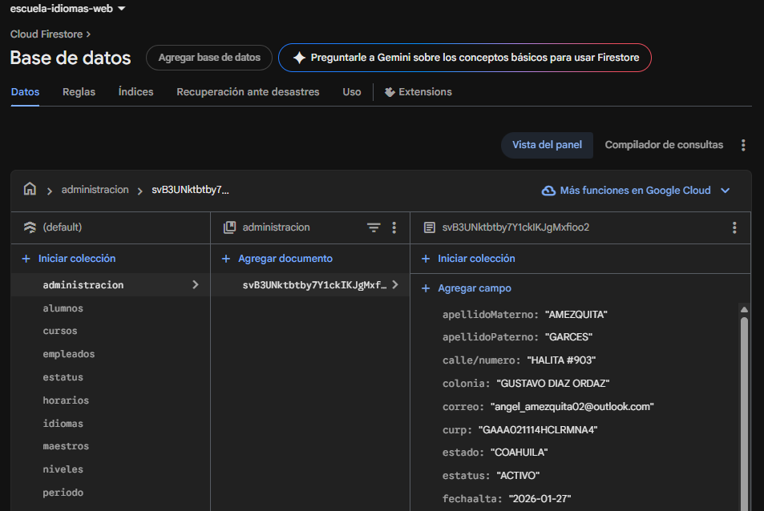
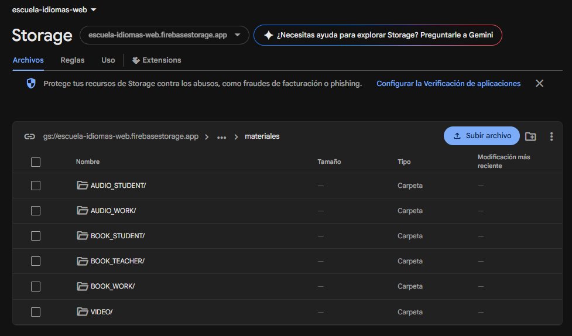
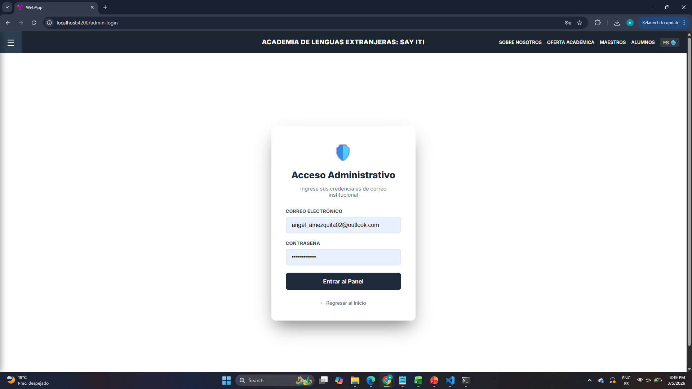
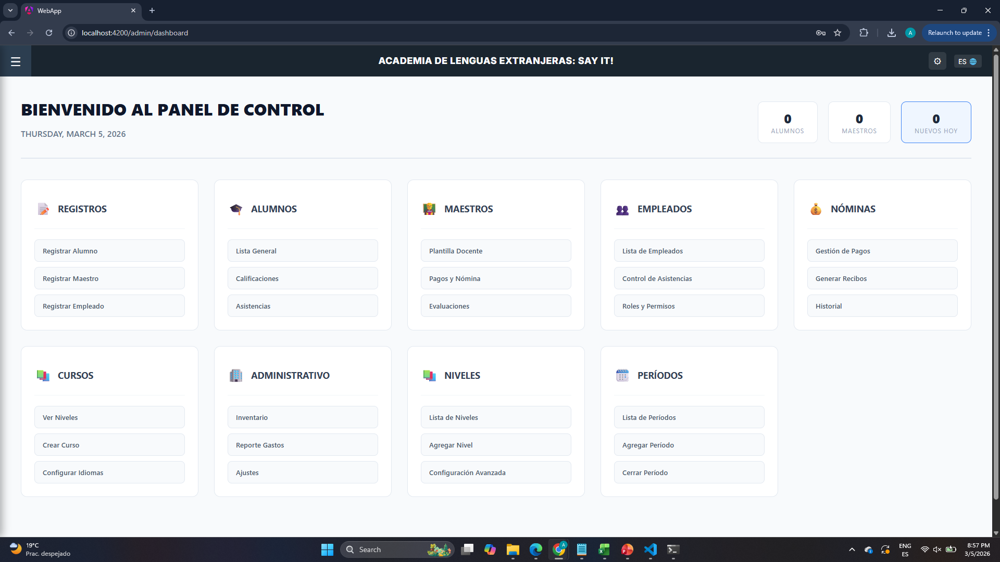
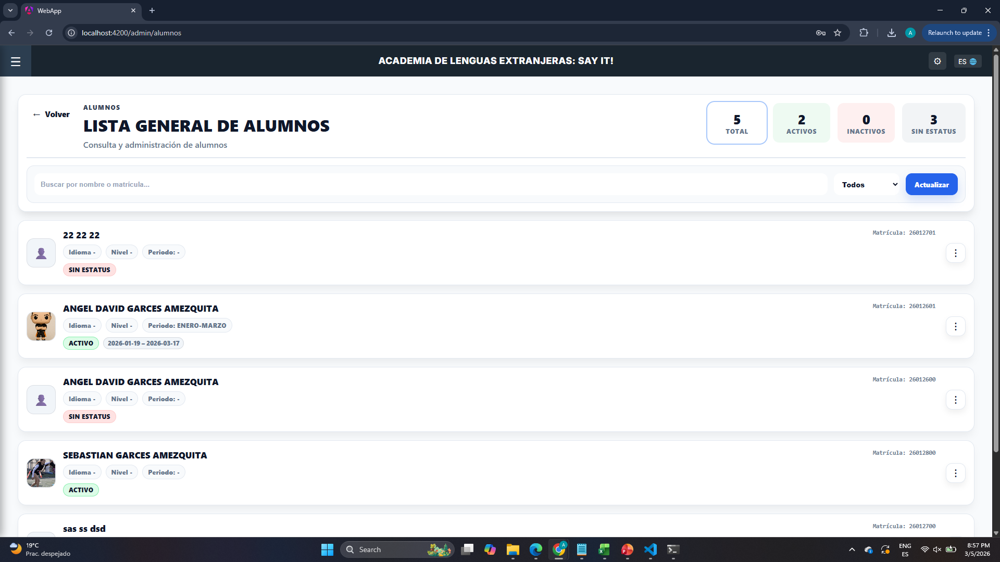
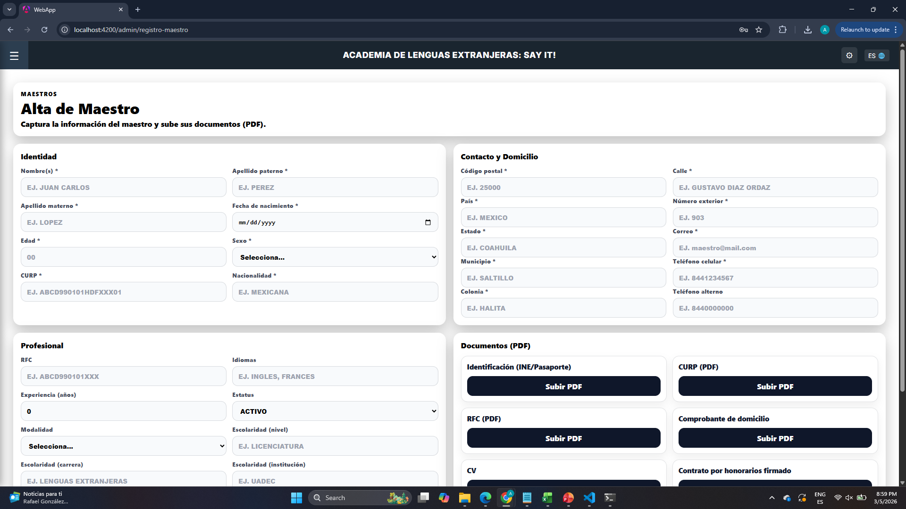
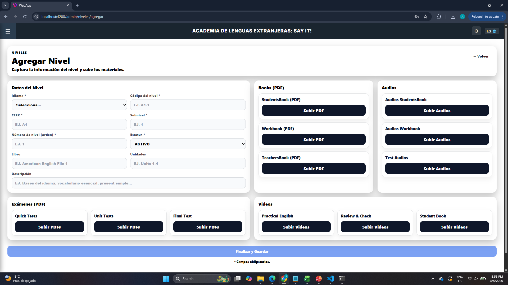
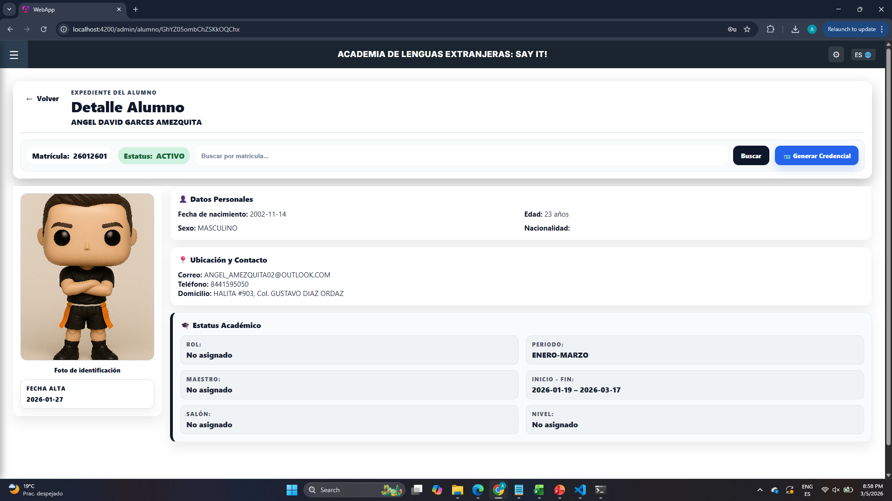
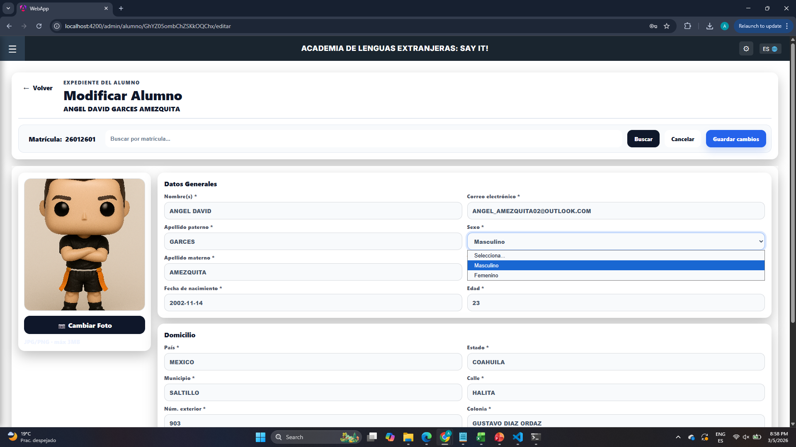
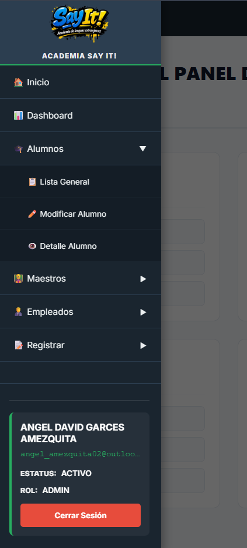

# Say It! – English Learning Platform


## Overview

Say It! is an internal academic management platform designed to support the operations of my own English language academy.

The system centralizes the management of students, teachers, academic levels, and course scheduling in a single web application. It was built to streamline administrative processes and provide clear visibility of academic operations as the academy grows.

The platform provides role-based dashboards for administrators, teachers, and students, allowing each role to interact with the system according to their responsibilities.

The application was developed using **Angular** with a modular architecture and integrates **Firebase services** for authentication, data storage, and cloud infrastructure.

### Main Capabilities

- Student registration and management  
- Teacher administration  
- Academic level configuration  
- Academic period management  
- Course and class scheduling  
- Role-based dashboards for administrators, teachers, and students  

<table width="100%">
<tr>

<td width="50%" valign="top">

## Problem

When launching a small educational program or language academy, many administrative tasks are handled manually through spreadsheets, messaging apps, or scattered documents.

This creates operational inefficiencies such as:

- Difficulty organizing student and teacher information  
- Limited visibility of academic periods and course assignments  
- Inefficient scheduling processes  
- Lack of centralized academic data  
- Increased risk of administrative errors

As the academy grows, these manual processes become harder to manage and limit the ability to scale operations efficiently.

</td>

<td width="50%" valign="top">

## Solution

Say It! was developed as an internal platform to support the academic operations of my own English learning program.

The system centralizes academic management into a single platform where administrators can manage students, teachers, academic levels, and course periods.

Teachers can access dashboards with their course and student information, while students can access their academic data through dedicated interfaces.

The platform was designed with a **modular and scalable architecture**, allowing the system to evolve as the academy expands and introduces new academic programs.

</td>

</tr>
</table>

---

# System Architecture

The platform was developed as an internal operational system for managing the academic processes of the Say It! English program.

It follows a modular web architecture built with Angular and Firebase services.

**Frontend** → Angular  
**Backend Services** → Firebase  
**Database** → Firestore  
**Authentication** → Firebase Authentication  
**File Storage** → Firebase Storage  

The application separates responsibilities across different modules such as administration, student access, teacher dashboards, and shared UI components.

---

# Core Modules

<table width="100%">
<tr>

<td width="50%" valign="top">

## ⚙️ Admin Module

Provides administrative control over the academic system.

**Capabilities**

- Student management  
- Teacher management  
- Academic level administration  
- Academic period configuration  
- Employee administration  
- Administrative dashboards  

</td>

<td width="50%" valign="top">

## 👨‍🏫 Teacher Module

Allows teachers to interact with academic information related to their courses.

**Capabilities**

- Teacher dashboard  
- Student list visualization  
- Course-related information access  
- Academic monitoring  

</td>

</tr>

<tr>

<td width="50%" valign="top">

## 🎓 Student Module

Provides students access to their academic information.

**Capabilities**

- Student dashboard  
- Course information access  
- Academic progress visualization  

</td>

<td width="50%" valign="top">

## 🧩 Shared Components

Reusable components used across the platform to maintain UI consistency.

**Includes**

- Navigation bar  
- Sidebar navigation  
- Topbar layout  
- Shared UI elements  
- Global services  

</td>

</tr>
</table>

---

# Firebase Integration

The platform integrates multiple Firebase services to provide backend functionality without the need for a traditional server infrastructure.

Firebase enables real-time data access, authentication management, and scalable cloud storage for the application.

The following Firebase services are used:

- **Firebase Authentication** – Manages user login and role-based access control  
- **Cloud Firestore** – Stores academic data such as students, teachers, levels, and periods  
- **Firebase Storage** – Stores files and media assets used by the platform  

### Example Firestore Collections

- alumnos  
- maestros  
- niveles  
- periodos  
- empleados  

### Firebase Infrastructure

<table width="100%">
<tr>

<td width="50%" align="center" valign="top">

**Cloud Firestore – Database Structure**



</td>

<td width="50%" align="center" valign="top">

**Firebase Storage – File Management**



</td>

</tr>
</table>

---

# UI Screenshots

The following screenshots illustrate key modules of the Say It! academic management platform, highlighting administrative workflows and system navigation.

<table width="100%">
<tr>

<td width="50%" align="center" valign="top">

### Login Interface



Secure authentication interface for administrators, teachers, and students using Firebase Authentication.

</td>

<td width="50%" align="center" valign="top">

### Admin Dashboard



Central administrative dashboard providing access to system modules and operational metrics.

</td>

</tr>

<tr>

<td width="50%" align="center" valign="top">

### Student Management



Administrative interface for managing student records, including registration, updates, and detailed views.

</td>

<td width="50%" align="center" valign="top">

### Teacher Registration



Interface for registering teachers and managing instructor profiles within the academic system.

</td>

</tr>

<tr>

<td width="50%" align="center" valign="top">

### Academic Level Management



Allows administrators to create and manage academic levels used within the learning program.

</td>

<td width="50%" align="center" valign="top">

### Student Detail View



Displays detailed student information including enrollment data and academic attributes.

</td>

</tr>

<tr>

<td width="50%" align="center" valign="top">

### Student Modification



Interface for updating student records and maintaining accurate academic data.

</td>

<td width="50%" align="center" valign="top">

### Navigation Sidebar



System navigation component providing quick access to all administrative modules.

</td>

</tr>
</table>

---

# Code Architecture

The project follows a modular frontend structure and uses Firebase as a serverless backend platform.

### Angular Root Component

The main application layout is built using Angular standalone components for routing and shared navigation.

```typescript
// src/app/app.ts

import { Component } from '@angular/core';
import { RouterOutlet } from '@angular/router';
import { Sidebar } from './shared/components/sidebar/sidebar';
import { Topbar } from './shared/components/topbar/topbar';

@Component({
  selector: 'app-root',
  standalone: true,

//FireBase Inicialization
import { initializeApp, getApp, getApps } from 'firebase/app';
import { getFirestore } from 'firebase/firestore';
import { getStorage } from 'firebase/storage';
import { getAuth } from 'firebase/auth';

import { firebaseConfig } from './firebase-config';

const app = getApps().length ? getApp() : initializeApp(firebaseConfig);

export const db = getFirestore(app);
export const storage = getStorage(app);
export const auth = getAuth(app);
  imports: [RouterOutlet, Sidebar, Topbar],
  templateUrl: './app.html',
})
export class App {}
